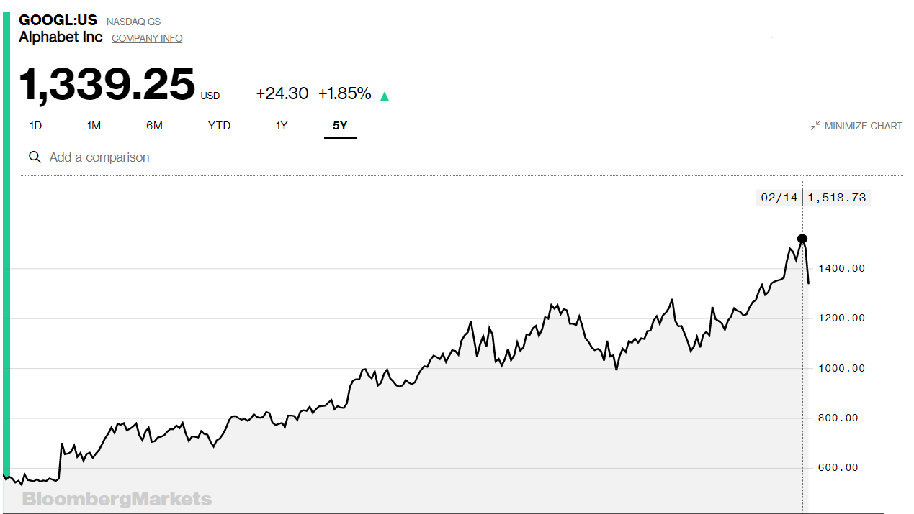

Navn: Christian Fosli

Fag: TEKBAV (essay)

Emne: Etikk

----

Data er den nye oljen, men hva med etikken?
===========================================

> The words most valuable resource is no longer oil,
> but data

(The Economist, 2017)

Data har en utrolig verdi, men det bringer også mange nye etiske
problemstillinger.
Hvem eier vår personlige data som vi etterlater oss på nettsider og som finnes i
diverse IT systemer?
Hvordan skal denne data kunne brukes?
Er det riktig at store IT selskaper tjener milliarder på målrettet reklame
grunnet data de har om oss?
Skal statlig overvåkning kunne brukes for å redusere kriminalitet? Hva med til
andre formål?

I denne teksten skal vi se nærmere på etiske problemstillinger rundt bruk av
personlig data.

### Eierskap

For å se nærmere på hva som er riktig bruk av personlig data er det
nyttig å drøfte litt om eierskap.
For hvem eier egentlig vår personlig data som vi etterlater oss på nettsider
og i forskjellige systemer?
I de fleste tilfeller er ikke dette noe det finnes ett svart-på-hvitt svar på.
Tankene våre blir farget av kulturen vår, samt lokale lover og regler.
Meningene mine omkring dette vil naturligvis være forskjellige fra hvordan
de fleste tenker i Asia, for eksempel Nord-Korea.

EU's _GDPR_ (General Data Protection Regulation) gir oss (omtalt som "data subject") rettigheter til
å bestemme over vår personlige data, men GDPR oppgir ikke eksplisitt om dataen
eies av oss ("data subject") eller selskapet som samler og er ansvarlig for dataen ("data
controller") (DPOrganizer, n.d.). Allikevel skaper EU's personverntiltak en
liberal kultur, hvor det blir naturlig å se på etiske situasjoner i "data subject's"
favør.
GDPR gir oss, europeere, rett til å eksportere og slette all vår personlige data
fra nettsider og systemer, ved å spørre selskapet som er ansvarlig for dataen om
dette.
I andre land og kulturer er dette uhørt.
Det er noe fint med åpenhet, klarhet og innsyn i lagring og prosessering av
personlig data.
Men det blir litt tidlig i teksten å gå for mye detalj allerede nå.
Mer detaljer kommer!

### Ulike syn

Noe som gjør bruk av personlig data på internet ekstra interessant,
er at det finnes så mange ulike syn på hva som er greit og ikke.
Ikke at det er så unikt, da.
Det finnes få etiske problemstillinger hvor svaret er enten rett eller galt.

Mange trykker impulsivt "OK" eller "Godkjenn" når det kommer en pop-up på
nettsiden som lyder "For å bruke \<nettside\> samtykker du vår bruk av cookies,
som vi/våre partnere bruker til \<insert reason here/>".
Andre slår av alt av scripts, cookies, og alt de kan i nettleseren sin,
for å unngå å bli sporet på internet.
Og mange er en plass i mellom.

Vi skal se nærmere på dette senere i teksten, men jeg føler denne tegneseriestripen
fra XKCD er en morsom og relevant illustrasjon til diskusjonen om bruk av
personlig data og personvern på internet.

(XKCD, n.d.).

### Statlig overvåkning

I Kina bruker myndighetene algoritmebasert overvåkning,
hvor innbyggerne får en score basert på hvordan de oppfører seg (Skybakmoen,
2018). Denne scoren er med på å bestemme hvorvidt man får ta opp lån, reise utenlands,
bli ansatt i enkelte yrker, eller kjøpe togbillett (Skybakmoen, 2018).
Skybakmoen forklarer: "Selve systemet kan bygge på at myndighetene henter
data direkte fra ulike teknologiselskaper og kombinerer disse med informasjonen
som finnes i offentlige registre" (Skybakmoen, 2018).
Kinesiske teknologiselskaper er pliktige å levere informasjon til myndighetene
(Lin, Chin, 2017). Dette gjør det mulig for myndighetene å overvåke ting som forbruksvaner og
ordvekslinger mellom venner på individnivå.
Statlig overvåking praktiseres også i vestlige land,
dogg ikke på samme måte som i Kina.

Statlig overvåking er en interessant problemstilling.
For enkelhets skyld, la oss ta for oss sosiale medier nettsiden Facebook.
På Facebook kommuniserer vi sammen med venner og bekjente.
Vi sender også private melding til hverandre på Facebook Messenger.
Det vil være naivt å tro at ingen private meldinger på Facebook Messenger
innrømmer kriminelle handlinger, eller planlegging av disse.
_Burde politiet fått fri tilgang til private meldinger på Facebook Messenger?_

Fri tilgang på private Facebook meldinger vil kunne forebygge kriminelle
handlinger og terror.
Ved å bruke dagens teknologi kunne vi enkelt laget ett system hvor bruk av
misstenksomme ord i samtaler trigger en varsel til politiet.
Politiet kunne så sjekket samtalen og iverksatt handlinger tidlig.
Med fremskritt innen machine-learning og AI kunne vi utarbeidet
algoritmer til intelligent oppdagelse av misstenksomme samtaler.
Slike samarbeid mellom teknologi-giganter og myndigheter ville kunne spart oss
både menneskeliv og penger.
Men, det ville vert på bekostning av vårt privatliv.

Enten jeg sender en privat melding til kona,
skriver noe morsomt i gruppechatten med vennegjengen,
legger til en reaksjon på ett litt shady meme jeg fikk fra han ene
kollegaen på jobben som har litt-på-kanten humorsmak,
eller hva det måtte være;
uansett hvilken form for melding eller innhold,
svarer jeg med den (muligens innbilte?) komfort at meldingen jeg sender kun vil
sees av samtalens medlemmer.
Dersom myndighetene ble gitt fri tilgang til våre "private" meldinger
ville det krenket vår frihet.
Jeg kunne ikke lenger sendt meldinger med den komfort om at den skulle sees av
meldingens oppgitte mottaker.
Jeg måtte også tenkt over hvorvidt meldingen kan tolkes som ett brudd på lover,
regler, normer, eller om den kan gi informasjon jeg vil holde privat.

Dette gjelder ikke bare Facebook Messenger, men alle mulige applikasjoner hvor
vi kommuniserer med hverandre. Også telefonsamtaler og SMS.
Det trenger heller ikke være slik at myndighetene enten har fri tilgang, eller
ingen tilgang.
En fin mellomveg kan være at politiet kan søke til teknologiselskaper om
informasjon om enkelte individer i en liten tidsperiode knyttet til en relevant
straffesak.

I tillegg til å få informasjon fra teknologiselskaper kan myndighetene også
samle data selv. Kombinasjonen av overvåkingskameraer, mikrofoner og
ansikts-gjenkjenning kan gi utrolig mye data.
I 2011 var det ca 52000 statlig-eide overvåkningskameraer i Storbritannia og
Nord-Irland (Wikipedia, n.d.-a).
Også her bør vi stille spørsmål rundt etikk og moral.
På en side kan slik informasjon hjelpe politi-arbeid og redusere kriminalitet.
På en annen side går det på bekostning av individers privatliv og frihet.

Boken 1984 av George Orwell viser, på mange måter, hvor galt det kan gå om
vi ikke setter noen etiske begrensninger til bruk av personlig data for statens
formål. Når Orwell skrev boken, skrev han om en dystopisk _framtid_ med
et totalitært system der ingen individuelle rettigheter finnes (dette var
skyggen av andre verdenskrig, 1984 var rundt 40 år frem i tid).

Orwell så for seg _telescreen's_ plassert i alle hus, kafeer, arbeidsplasser,
og til og med toaletter.
En _telescreen_ er en TV som også overvåker det som er foran den.
Staten har hemmelige politi kalt _thought police_ som overvåker dataen som samles
inn fra _telescreen's_, og arresterer individer som blir tatt for å ha andre
meninger en landets eneste politiske party (Wikipedia, n.d.-b).
Såkalt _thought crime_.

Dersom noen ble tatt for _thought crime_ ble det som om personen aldri hadde eksistert.
Personen ble arrestert, så ble alle referanser til personen
(fra avisartikler, bøker, o.l.) fjernet.
Personen vil nå være en _ikke-person_ ("unperson").
Alle som har kjent noen som ble tatt for _thought crime_ måtte glemme personen,
hvis ikke ville de også praktisere _thought crime_, ved å tenke på en
_ikke-person_ (Wikipedia, n.d.-b).

Boken 1984 er en dyster spådom. Men, det er skjønnlitteratur, og trenger ikke å
være realistisk.
Allikevel vekker den mange tanker rundt statlig overvåkning og totalitarisme.

### Kommersiell bruk, verdi og angrep

> For most companies, their data is their single biggest asset.

(MIT Technology Review, 2016, s.1)

I 2013 angrep en gruppe cyberkriminelle ett av verdens største online
billettbutikker.
De stjal ikke kredittkortinformasjon, men heller påloggingsinfo til
gyldige brukerkontoer.
De kjøpte så billetter til sportsarrangementer og konserter ved å bruke
de stjålne brukerkontoene, og solgte billettene videre for kontanter.
(MIT Technology Review, 2016, s.2).

Denne typen internet-tyveri er ikke uvanlig,
og digitale tyver er ofte vanskelig å merke,
da de gjerne skjuler seg bak gyldige brukerkontoer de har stjålet tilgang til.
I 2015 ble 13.1 millioner mennesker i USA berørt av identitetstyveri
(MIT Technology Review, 2016, s.2).

Dette stiller spørsmål til hvilken type sikkerhet vi, brukere, kan forvente att
nettsidene hvor vi etterlater oss personlig informasjon har på plass.
Dataen har nemlig ikke kun en stor verdi for cyberkriminelle, men også for
selskapet som samler dataen.
Uten data som påloggingsinformasjon, brukerinformasjon og betalingsinformasjon
ville ikke den online billettbutikken kunne levert samme verdi til sine kunder.
Dette er noe selskaper som AirBnb, Facebook og Netflix har innsett, mens de
endret konkurransevilkårene i sine bransjer (MIT Technology Review, 2016, s.2).
Det er det sjeldent en bra løsning å ikke lagre noe personlig data.
Da vil ikke selskapet kunne forbli konkurransedyktig.
Fokuset bør heller være på å gjøre det på riktig,
og på en sikker, -måte.

Bruk av data gjør det mulig for selskaper å tilby brukerne en personlig
opplevelse.
Netflix viser meg topp filmer og serier både i landet jeg er fra,
og spesifikt for meg.
Facebook viser meg de innleggende jeg trolig er mest interessert i øverst,
blandet med sponsede innlegg til produkter eller konferanser som passer mine
interesser.
Google tilpasser søkeresultatene i forhold til hvem som søker,
og øverst i resultatene finner jeg ofte en annonse som både er relatert til det
jeg søkte på, og som er relevant _for meg_.

Slike personlige brukeropplevelser har helt klart en stor verdi.
Det er vanskelig å putte en pris på gode, personlige brukeropplevelser.
Jeg føler aksjekursen til Alphabet, selskapet bak Google tegner ett riktig
bilde.

(Bloomberg, 2020)

Ok, vi har sett at personlig data kan brukes til å skape fantastiske personlige
brukeropplevelser. Bra! Fint! Flott!
_Men, er alt bare bra?_
Facebook har fått mye pes for å spre politisk feilinformasjon.
I 2016 hyrte Trump's president kampanje konsulenter fra Cambridge Analytica som
utnyttet Facebook-brukernes private data for å påvirke stemmen deres i valgkampen
(Ghaffary, 2020).

Cambridge Analytica saken har blitt omtalt i media som en _stor politisk skandale_.
Slike hendelser vekker en del spørsmål rundt teknologiselskapers makt,
og om deres bruk at personlig data burde reguleres.

_Men hvor mange brukere gjaldt dette? Og hvordan klarte Cambridge Analytica å
utnytte dataen deres?_ tenker du kanskje.
Det har nemlig Wikipedia svaret på.
Det begynte nemlig ganske så uskyldig;
Aleksandr Kogan, en dataforsker på Cambridge University utviklet en applikasjon
kalt "This Is Your Daily Life" (noen steder skrevet "thisisyourdailylife")
(Wikipedia, 2018).
Kogan gav applikasjonen til Cambridge Analytica, som ordnet med en
spørreundersøkelse for akademisk bruk som flere hundre-tusen Facebook brukere
takket ja til å delta i (Wikipedia, 2018).
So far so good, disse hundre-tusen brukerne hadde selv gitt samtykke til å
dele sin data til applikasjonen.
Her kommer problemet:
Facebook's design gjorde det mulig for applikasjonen å hente inn personlig data,
ikke bare til de som hadde takket ja til spørreundersøkelsen,
men også til alle personer i disse brukernes sosiale (Facebook) nettverk
(Wikipedia, 2018).
Slik fikk Cambridge Analytica personlig data til _millioner_ av Facebook
brukere (Wikipedia, 2018).

Cambridge Analytica hadde nå detaljert personlig data til millioner av Facebook
profiler (Wikipedia, 2018).
For en politisk kampanje kunne de bruke denne dataen til å foreslå hvilke type
reklamer ville være mest effektive for en bestemt person i ett bestemt området
(Wikipedia, 2018).
Og flesteparten av personene som fikk dataen sin utnyttet hadde aldri
gitt samtykke til det!

Nå ser jeg forresten at jeg begynner å nærme meg grensen til å ha for lang
kildeliste.
Den skulle nemlig være på maks ca 5% av teksten.
Dermed prøver jeg å ha litt mer mine meninger,
og litt mindre gjenfortellinger/ideer/historier i resten av teksten.
Det er forsåvidt rom for det også i ett essay.
De er jo typisk både saklige, og kan inneholde en del personlige meninger.
Jeg føler allikevel det er nyttig å referere til andre.
Jeg lærer mye av å lese, og å gjenfortelle andres meninger og poeng.
Og jeg har ikke kunnskap nok om emnet til å få ned 5000 ord på papiret kun fra
egne tanker rundt dette.
Det tror jeg de færreste har.

Tilbake til Fake-News på Facebook.
Siden Cambridge Analytica skandalen har Facebook iverksatt tiltak for å unngå
flere lignende skandaler.
De bruker nemlig tredjeparts fakta sjekker,
for å unngå virale politiske fake-news posts (Ghaffary, 2020).
De har også valgt å implementere EU's GDPR reglemang også utenfor Europa
(Wikipedia, 2018).
Dette gir brukerne mye mer informasjon om hvilken personlig data selskapet
samler, hvordan denne brukes, og lar brukerne slette og/eller eksportere dataen
sin.

Nå har vi sett litt på hvordan personlig data kan brukes til å skape verdi for
brukerne i form av personlig brukeropplevelse og løsninger tilpasset til meg.
Og vi har sett ett par eksempler på hvordan personlig data kan havne på avveie
og/eller bli missbrukt.
Det er altså nyttig for selskapene med personlig data,
men det burde vært klarere retningslinjer rundt hvordan data skal
brukes og beskyttes.
Det er ikke så lett å definere slike retningslinjer,
da forskjellige individer, gjerne fra forskjellige kulturer,
vil ha forskjellige meninger på hva som er greit og ikke.

Dersom selskaper både forriker brukeropplevelsen ved bruk av personlig data,
men også sikrer at dataen ikke kan komme på avveie, så er dette tipp-topp
i mine øyne.
Men det å sikre at dataen ikke kommer på avveie,
det viser seg å være enklere sagt enn gjort.
For når resursstore teknologigiganter ikke alltid får det til,
kan det være vanskelig for mindre selskaper å få til riktig,
og å få dem til å innse viktigheten av dette,
slik at det blir prioritert.

Ett annet spørsmål er hvordan selskaper skal kunne bruke dataen de innhenter.
Mine synspunkt på bruk av personlig data for å forbedre brukeropplevelsen regner
jeg med er ganske klare til nå.
Selskapene kan også tjene penger på å dele eller selge dataen videre,
for eksempel til reklameselskaper.
Dette kan være nyttig for oss, brukerne,
ved at vi får relevant reklame for ting vi er interessert i.
Eller det kan føre til målrettet "fake-news" og politiske kampanjer som med
Cambridge Analytica skandalen.
Uavhengig av om dataen brukes til relevant reklame eller _ikke helt innafor_
"reklame",
kan vi stille spørsmål til om det er riktig at selskaper tjener millioner på
_vår_ data.
Vi får ikke noen andel av denne inntekten tilbake,
bortsett fra kanskje gratis tjenester, da.

Selskaper som Facebook, Twitter og Google tilbyr de fleste tjenestene sine helt
gratis.  Eller _"gratis"_.
Vi _"betaler"_ nemlig ved å gi dem data om oss selv,
som de så kan bruke til å gi oss målrettet reklame.
Og business modellen går strålene.
Jeg skulle gjerne kommet med litt eksempler på inntjening, aksjeverdi, etc,
men dessverre kan jeg ikke de tallene i hodet.
Og så var det det problemet med at kildelisten er blitt litt lang.
Uansett, dataen har helt klart en stor forretningsverdi for disse selskapene.
Da det er _vår_ data de tjener penger på,
kunne det vert interessant med mer lover, regler, og retningslinjer på hvordan
det skal kunne gjøres.
På moralsk vis.

Tenk hvis Facebook lot deg velge mellom å bruke nettsiden gratis,
eller å betale en månedlig sum,
men ikke få noe reklame,
og ikke få noe av dataen din delt med partnere eller reklameselskaper.
Det kunne vert en interessant lov,
å gi brukerne valg over hvordan dataen deres skal kunne brukes,
og tilby alternative løsninger der brukeren ikke vil dele data.

### Datadrevet beslutningstaking

Datadrevet beslutningstaking kan ses på som et alternativ til moralsk
beslutningstaking.
Å ta en datadrevet beslutning vil si at man _bruker data_ til å
sette mål, identifisere problemer, søke etter og evaluere valg,
og bestemme handlinger (Wang, 2019).
Moralsk beslutningstaking, derimot, går ut på å gjøre det man ser på
som riktig, akseptert og etisk.

Datadrevet beslutningstaking gir oss mange muligheter vi aldri hadde før.
Fremskritt i AI (Artificial Intelligence / kunstig intelligens),
i tillegg til økt datakraft,
gjør det mulig å gjøre gjøre store kalkulasjoner med store mengder data.
For eksempel selvkjørende biler er ett velkjent eksempel,
hvor store mengder data brukes til å trene en maskinlæringsalgoritme,
og så tar bilen beslutninger basert på historisk data.

Datadrevet beslutningstaking brukes også i større grad i andre yrker,
som til lege og helse -relaterte beslutninger.
Og etterhvert som maskinlæring og AI teknologi videreutvikles vil vi se mer og
mer bruk av dette på tvers av yrker og næringer.

En stor fordel med datadrevet beslutningstaking,
i forhold til moralsk beslutningstaking,
er at datadrevet beslutningstaking kan automatiseres.
En PC har ingen formening om hva som er _etisk_.
Om hva som er _riktig_.
Men den kan gjøre datadrevne beslutninger.
Som for eksempel å styre en bil på veien.

For å gjøre datadrevet beslutningstaking kreves naturligvis data.
Og denne dataen må prosesseres og behandles.
Her blir det viktig å gjøre etiske vurderinger før man bare "kjører på".
La oss lage ett eksempel.

Det er ikke utenkelig at statlige virksomheter vil bruke datadrevet
beslutningstaking til samfunnsrelaterte problemer og offentlige tjenester.
Det er da også svært sannsynlig at staten bruker tjenester eller konsulenter
fra kommersielle virksomheter til dataprosessering.
I så tilfelle må staten være klar over hvilke bekymringer innbyggerne kan ha
rundt deling av deres data med kommersielle virksomheter.
Staten må da også påse at disse virksomhetene er til å stole på,
at de behandler dataen på en sikker måte,
og at de ikke bruker den til annet en tiltenkt.

Også om dataen skulle behandles kun av statlig ansatte måtte staten allikevel
sikret seg mot uetisk behandling og korrupsjon.
Dersom for eksempel en ansatt laster opp konfidensiell data på sosiale medier,
eller lagrer dataen på en usikker skytjeneste og den deretter kommer på avveie,
kan det få store negative konsekvenser.

Ansvarlig bruk av data er ikke bare moralsk riktig,
men også bra business practice.

I tillegg til sikkerhetsrisiko ved at data kommer på avveie,
får vi også nye risikoer knyttet til gyldigheten og riktigheten til dataen.
Dette åpner for en ny type _"hacking"_,
hvor angripere _"saboterer"_ dataen,
og slik får systemer til å ta _feil_ beslutninger.
Første gang jeg hørte om dette var nå nylig,
når artisten Simon Weckert gikk rundt langs gatene Berlin
med 99 smarttelefoner i en trillebår (Barret, 2020).
Slik lurte han Google Maps sine algoritmer til å tro det var et stort
trafikkkork (Barret, 2020).

### General Data Protection Regulation

EU's GDPR lager en rekke lover og regler rundt mye av det vi har snakket om i
denne teksten.

Jeg tar her for meg litt sitater fra [gdpr-info.eu](gdpr-info.eu) og diskuterer litt rundt det.
[gdpr-info.eu](gdpr-info.eu) inneholder GDPR lovverket, også kalt Regulation
2016/679, i PDF format, men forklarer også en del nøkkel-problemstillinger i ett
litt mer lett-leselig format.

Det er stort sett deler av nøkkel-problemstilling tekstene jeg siterer.

#### Samtykke (Consent)

> Processing personal data is generally prohibited,
> unless it is expressly allowed by law,
> or the data subject has consented to the processing.
> While being one of the more well-known legal bases for processing personal data,
> consent is only one of six bases mentioned in the General Data Protection Regulation (GDPR).
> The others are: contract, legal obligations, vital interests of the data subject,
> public interest and legitimate interest as stated in Article 6(1) GDPR.

(Intersoft Consulting, n.d.-a)

GDPR krever altså samtykke fra brukerne det samles personlig data fra,
men mindre det det er eksplisitt tillat av en lov (Intersoft Consulting,
n.d.-a).
Dette betyr at nettsidene må spørre brukerne om lov før de samler inn og
behandler deres personlige data.

Dette mener jeg er positivt.
Det er moralsk å spørre om lov før man gjør noe man er usikker på om noen
tillater.
Slike lovverk gjør også at vi,
brukerne,
forventer å bli spurt før vår data blir lagret/behandlet.
Det bidrar dermed til å skape en kultur hvor samtykke er viktig i slike
tilfeller.

På den andre siden kan brukerne bli lei av at alle nettsidene man går inn på gir
oss pop-ups vi må godkjenne før vi får brukt nettsiden.
I verste fall blir det sett på som _unødvendig støy_,
og kan gjøre oss mindre oppmerksomme på innholdet,
og dermed kan brukerne bli lurt til å godkjenne vilkår de ikke burde.

Selv om det kan gi en noe dårligere brukeropplevelse ved første sidebesøk,
mener jeg det er positivt at nettsidene får samtykke før de lagrer og behandler
personlig data.

#### Kryptering (Encryption)

> Companies can reduce the probability of a data breach
> and thus reduce the risk of fines in the future,
> if they chose to use encryption of personal data.
> The processing of personal data is naturally associated with a certain degree of risk.
> Especially nowadays, where cyber-attacks are nearly unavoidable for companies
> above a given size.
> Therefore, risk management plays an ever-larger role in IT security
> and data encryption is suited, among other means, for these companies.

(Intersoft Consulting, n.d.-b)

Kryptering av personlig data kan altså redusere risikoen for datainnbrudd
(Intersoft Consulting, n.d.-b).
Det sier egentlig seg selv,
da selv om en angriper skulle få brytt seg inn i databasen,
vil de ikke kunne bruke dataen til noe om den er kryptert på en sikker måte.
Beskrivelsen over er litt uklar, da, det er litt vanskelig å vite hvor stort en
_"given size"_ er og hvilke selskaper dette gjelder.
Jeg tror _key take-away_ er å kryptere _viktig_ _konfidensiell_ informasjon.

Det finnes eksempler på selskaper som lagrer passord i klartekst.
Noe som helt klart bryter disse reglene.
Det ser jeg på som uetisk lagring av konfidensiell data.

#### Records of Processing Activities

> The General Data Protection Regulation obligates,
> as per Art. 30 of the GDPR,
> written documentation and overview of procedures by which personal data are processed.
> Records of processing activities must include significant information about data processing,
> including data categories,
> the group of data subjects,
> the purpose of the processing and the data recipients.
> This must be completely made available to authorities upon request.

(Intersoft Consulting, n.d.-c)

Her ser vi nettsidene / selskapene må kunne dokumentere hvilken personlig data
de prosesserer, hvorfor, og deres prosedyrer,
og de må kunne gi en oversikt over utførte behandlingaktiviteter hvis
myndighetene ved forespørsel fra myndighetene (Intersoft Consulting, n.d.-c).

Det bidrar til god kultur at selskapene kan dokumentere databehandlingskyeaktiviteter,
nøyaktig og med årsak for hver aktivitet.
Dette bidrar til at selskaper ikke lagrer masse personlig data de ikke trenger.
Det er bra.

#### Right to be Forgotten

> The right to be forgotten derives from the case Google Spain SL,
> Google Inc v Agencia Española de Protección de Datos,
> Mario Costeja González (2014).
> For the first time, the right to be forgotten is codified and to be found in
> the General Data Protection Regulation (GDPR) in addition to the right to erasure.

> The correspondingly-named rule primarily regulates erasure obligations.
> According to this, personal data must be erased immediately where the data are
> no longer needed for their original processing purpose,
> or the data subject has withdrawn his consent and there is no other legal
> ground for processing, the data subject has objected and there are no overriding
> legitimate grounds for the processing,
> or erasure is required to fulfil a statutory obligation under the EU law
> or the right of the Member States.
> In addition, data must naturally be erased if the processing itself
> was against the law in the first place.

(Intersoft Consulting, n.d.-d)

Dette er viktig!
På samme måte som det er god moral å spørre om lov før man gjør noe man er
usikker på om er greit, er det god moral å slutte å gjøre aktiviteten om de man
spør endrer mening.

Det kan også ødelegge både karrièremuligheter og image om personlig data som
tilsier noe negativt om en person ligger ute på internet.
For eksempel relatert til en straffesak / fengselstraff.
Eller bare et upopulært sitat.
Eller kanskje noen legger ut ett nakenbilde av en ex-kjæreste.
En kjent "saying" på nettet er _"what goes online stays online"_.
Det er ofte en svært dårlig ting.
Denne GDPR loven hjelper å motvirke dette.

Selv om det vil være vanskelig å slette all informasjon om en hendelse om det
havner på internet,
gjør denne loven mye for å få det til.

For eksempel på Facebook kan du slette profilen din;
da skal også all personidentifiserende informasjon som er knyttet til kontoen
din bli fjernet fra databasen deres (slettmeg.no, 2019).
GDPR krever altså tilsvarende funksjonalitet for alle nettsider som samler data om
europeiske brukere.
Det trenger dogg ikke å være like brukervennlig og _selvbetjent_ som på Facebook.

#### Right to be Informed

> There is a need for transparency regarding the gathering and use of data in
> order to allow EU citizens to exercise their right to the protection of personal data.
> Therefore, the General Data Protection Regulation (GDPR) gives individuals
> a right to be informed about the collection and use of their personal data,
> which leads to a variety of information obligations by the controller.
> The law differentiates between two cases: On the one hand,
> if personal data is directly obtained from the data subject
> (Art. 13 of the GDPR) and, on the other hand,
> if this is not the case (Art. 14 of the GDPR).

(Intersoft Consulting, n.d.-e)

Åpenhet rundt lagring og bruk av data bidrar positivt til en åpen og klar
kultur.
Jeg tror brukerne viser mye større aksept for lagring og prosessering av
personlig data når nettsidene de besøker er åpne om hvilken data de
lagrer/prosesserer og hvorfor.
Spesielt når dette blir gjort på en klar og tydelig måte.

Det kan gjerne være lettere sagt enn gjort,
da dataen gjerne kan brukes i svært komplekse algoritmer,
og til flere bruksområder.
Men jeg mener dette er viktig.
Alt for mye tekniske detaljer trenger ikke være nødvendig å påpeke,
da det kan gjøre brukerne forvirret og gjøre at de ikke får med seg de
vesentlige delene.

Vi ser i sitatet over at GDPR differensierer mellom data som mottas direkte fra
brukeren (data subject), og data som mottas på andre måter
(Intersoft Consulting, n.d.-e).
Dette er interessant.
Når dataen mottas direkte fra brukeren kan man informere brukeren om bruken
direkte og motta samtykke fra brukeren før man går igang.
Eller, ikke bare _kan man_, _må man_ er mer riktig.
Men _hva med når dataen ikke mottas direkte fra "data subject"_?
Da er det ikke akkurat lett å spørre i forkant.

Det står beskrevet en prosedyre for det også.
Dersom dataen ikke mottas direkte fra "data subject" må han/hun få informasjon i
løpet av rimelig tid, og senest i løpet av en måned (Intersoft Consulting,
n.d.-e), står det.
Informasjonen må komme frem på en presis, klar, forståelig og lett tilgjengelig
måte, akkurat slik som når dataen mottas direkte fra brukeren (Intersoft
Consulting, n.d.-e). I tillegg må selskapet som lagrer/behandler dataen også
informere om hvor dataen kom fra (når den ikke kom fra brukeren direkte)
(Intersoft Consulting, n.d.-e).
Det gjøres enkelte unntak hvor det ikke kreves å informere brukeren (data
subject).
Det gjelder når å gi slik informasjon er enten umulig eller urimelig dyrt,
eller når innsamlingen av informasjonen er lovpålagt,
eller når dataen må forbli konfidensiell grunnet taushetsplikt eller lignende
(Intersoft Consulting, n.d.-e).

Personlig tenker jeg noen av disse unntakene kan være en uting.
Jeg er for åpenhet rundt lagring og deling av data,
og ser ikke for meg det kommer til skade at informasjonen ville deles med meg
også når dataen min behandles av lovpålagte årsaker.
Men, de som har skrevet GDPR lovverket har naturligvis brukt mer tid på å sette
seg inn i dette enn det jeg har.
Og jeg regner med det er gode grunner til unntakene.

Uansett mener jeg GDPR er en svært positiv ting rundt både å sikre ansvarlig
bruk av data hvor nettsider samler data om europeiske brukere,
og også for å få en mer åpen og klar kultur rundt bruk av personlig data.
Det koster gjerne litt penger for selskapene å implementere reglemagnet,
men prisene på EU's bøter gjør det nok lite attraktivt å lure seg unna i lengden.

### Personvernerklæring

Nettsider som behandler personopplysninger / personlig data må gi
informasjon om dette til besøkende.
Dette gjøres vanligvis ved hjelp av en personvernerklæring.
Personvernerklæringen inneholder informasjon hvilke data som behandles,
og hvordan.
Å behandle data på andre måter en nevnt i personvernerklæringen er ikke bare
umoralsk, men kan også være ulovlig (Datatilsynet, 2018).
Og som sagt umoralsk.
Og moral og etikk har jo mye med hverandre å gjøre,
så det er jo ganske relevant,
tenker jeg.

Det er ganske stor forskjell på personvernerklæringer.
Noen er veldig uklare og generelle,
mens andre forteller helt konkret hvordan dataen blir behandlet, etc.
Det kan være fristende for bedrifter og teknologiselskaper å bruke en svært
uklar og generell personvernverklæring,
slik at de slipper å holde den oppdatert kontinuerlig når funksjonaliteten
og derav behov for databehandling endres i applikasjonen.
Men her må bedriftene tenke seg godt om.
_For er det egentlig greit å gi informasjon om databehandlingen på en måte som
brukerne ikke forstår?_

Jeg tenker at informasjon om databehandling og lagring må komme frem på en
måte som brukerne forstår.
Noe annet vil være umoralsk, tenker jeg.

### Konklusjon

Det er vanskelig å komme med noe klar konklusjon.
Etiske tolkninger avhenger som sagt av kultur og andre ting.
Men jeg håper teksten har vekt en del tanker rundt det etiske rundt lagring og
behandling av personlig data.
En ting er klart,
etikk har en stor viktighet mens teknologi og databehandling forbedres videre.
Svarene er ikke alle klare,
men problemstillingene må tas i betraktning
mens innovasjonen fortsetter.

## Kilder

* The Economist. (2017, 6 mai). Regulating the internet giants - The world’s
  most valuable resource is no longer oil, but data.
  Hentet fra [www.economist.com/leaders/2017/05/06/the-worlds-most-valuable-resource-is-no-longer-oil-but-data](
  https://www.economist.com/leaders/2017/05/06/the-worlds-most-valuable-resource-is-no-longer-oil-but-data).

* XKCD. (n.d.). xkcd: Privacy Options. Hentet fra [https://xkcd.com/1269/](https://xkcd.com/1269/)

* DPOrganizer. (n.d.). Who owns your personal data under GDPR?.
  Hentet fra [www.dporganizer.com/who-owns-personal-data/](
  https://www.dporganizer.com/who-owns-personal-data/).

* Skybakmoen, Jonas. (2018, 20 februar). De sju drøyeste tiltakene: Slik overvåker Kina egne innbyggere i 2018.
  _filternyheter_. Hentet fra [https://filternyheter.no/de-sju-droyeste-tiltakene-slik-overvaker-kina-egne-innbyggere-i-2018/](
  https://filternyheter.no/de-sju-droyeste-tiltakene-slik-overvaker-kina-egne-innbyggere-i-2018/).

* Liza Lin and Josh Chin. (2017, 30 november). China’s Tech Giants Have a Second Job:
  Helping Beijing Spy on Its People. _The Wall Street Journal_. Hentet fra
  [https://www.wsj.com/articles/chinas-tech-giants-have-a-second-job-helping-the-government-see-everything-1512056284](
  https://www.wsj.com/articles/chinas-tech-giants-have-a-second-job-helping-the-government-see-everything-1512056284).

* Wikipedia. (n.d.-a). Mass surveillance in the United Kingdom.
  Hentet fra [https://en.wikipedia.org/wiki/Mass_surveillance_in_the_United_Kingdom](
  https://en.wikipedia.org/wiki/Mass_surveillance_in_the_United_Kingdom)

* Wikipedia (n.d.-b). Thought Police. Hentet fra [https://en.wikipedia.org/wiki/Thought_Police](
  https://en.wikipedia.org/wiki/Thought_Police)

* MIT Technology Review. (2016). The Rise of Data Capital (quote from pdf).
  Hentet fra [http://files.technologyreview.com/whitepapers/MIT_Oracle+Report-The_Rise_of_Data_Capital.pdf](
  http://files.technologyreview.com/whitepapers/MIT_Oracle+Report-The_Rise_of_Data_Capital.pdf)

* Bloomberg. (2020, 1 mars). Skjermbilde fra
  [https://www.bloomberg.com/quote/GOOGL:US](https://www.bloomberg.com/quote/GOOGL:US)

* Shirin Ghaffary. (2020, 24 februar). A senator is demanding to know how
  Facebook will stop misinformation from spreading online. _Vox_.
  Hentet fra [https://www.vox.com/recode/2020/2/24/21147428/facebook-2020-elections-misinformation-senator-michael-bennet-letter-zuckerberg](
  https://www.vox.com/recode/2020/2/24/21147428/facebook-2020-elections-misinformation-senator-michael-bennet-letter-zuckerberg)

* Wikipedia. (2018). Facebook-Cambridge Analytica Data Scandal.
  Hentet fra [https://en.wikipedia.org/wiki/Facebook%E2%80%93Cambridge_Analytica_data_scandal](https://en.wikipedia.org/wiki/Facebook%E2%80%93Cambridge_Analytica_data_scandal)

* Wang, Y. (2019).
  Is data-driven decision making at odds with moral decision making?
  A critical review of school leaders’ decision making in the era of school accountability.
  Values and Ethics in Educational Administration, 
  Hentet fra [http://3fl71l2qoj4l3y6ep2tqpwra.wpengine.netdna-cdn.com/wp-content/uploads/2019/10/VEEA-142.pdf](
  http://3fl71l2qoj4l3y6ep2tqpwra.wpengine.netdna-cdn.com/wp-content/uploads/2019/10/VEEA-142.pdf)

* Barret, B. (2020, 2 mars).
  An artist used 99 phones to fake a google maps traffic jam. _Wired_.
  Hentet fra [https://www.wired.com/story/99-phones-fake-google-maps-traffic-jam/](
  https://www.wired.com/story/99-phones-fake-google-maps-traffic-jam/)

* Intersoft Consulting. (n.d.-a). Consent | General Data Protection Regulation.
  Hentet fra [https://gdpr-info.eu/issues/consent/](https://gdpr-info.eu/issues/consent/)

* Intersoft Consulting. (n.d.-b). Encryption | General Data Protection Regulation.
  Hentet fra [https://gdpr-info.eu/issues/encryption/](https://gdpr-info.eu/issues/encryption/)

* Intersoft Consulting. (n.d.-c). Records of Processing Activities | General Data Protection Regulation.
  Hentet fra [https://gdpr-info.eu/issues/records-of-processing-activities/](
  https://gdpr-info.eu/issues/records-of-processing-activities/)

* Intersoft Consulting. (n.d-d). Right to be Forgotten | General Data Protection Regulation.
  Hentet fra [https://gdpr-info.eu/issues/right-to-be-forgotten/](
  https://gdpr-info.eu/issues/right-to-be-forgotten/)

* Intersoft Consulting. (n.d.e). Right to be Informed | General Data Protection Regulation.
  Hentet fra [https://gdpr-info.eu/issues/right-to-be-informed/](
  https://gdpr-info.eu/issues/right-to-be-informed/)

* Datatilsynet. (2018, 8 juni). Hvordan skal virksomheten gi informasjon?
  Hentet fra
  [https://www.datatilsynet.no/rettigheter-og-plikter/virksomhetenes-plikter/gi-informasjon/informasjon-og-apenhet/hvordan-skal-virksomheten-gi-informasjon/](
  https://www.datatilsynet.no/rettigheter-og-plikter/virksomhetenes-plikter/gi-informasjon/informasjon-og-apenhet/hvordan-skal-virksomheten-gi-informasjon/)

* Slettmeg.no. (2019, 7 februar). Slik sletter du deg fra Facebook.
  Hentet fra [https://slettmeg.no/veiledninger/slik-sletter-du-deg-fra-facebook](https://slettmeg.no/veiledninger/slik-sletter-du-deg-fra-facebook)
